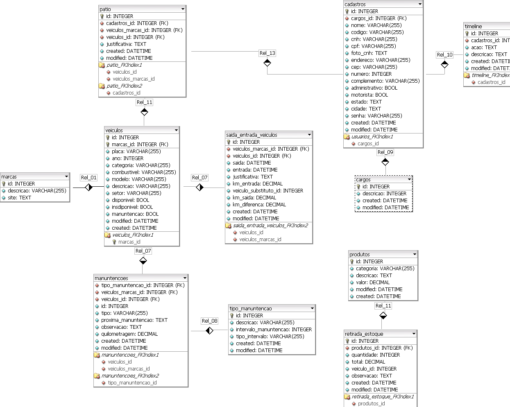

## Refatoração do sistema de gerenciamento de frota
Reconstrução do sistema de gerenciamento de frota de ônibus escolares rurais.

### Modelagem do banco de dados

- SpringBoot MVC 
    https://www.baeldung.com/spring-boot-start
- JPA
    https://www.tutorialspoint.com/pg/jpa/jpa_entity_relationships.htm
- MVC
    https://tableless.com.br/mvc-afinal-e-o-que/#:~:text=MVC%20%C3%A9%20nada%20mais%20que,camada%20de%20controle(controller).
